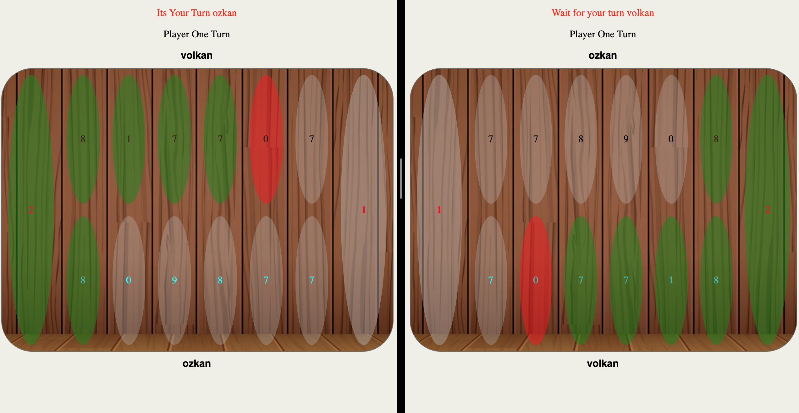
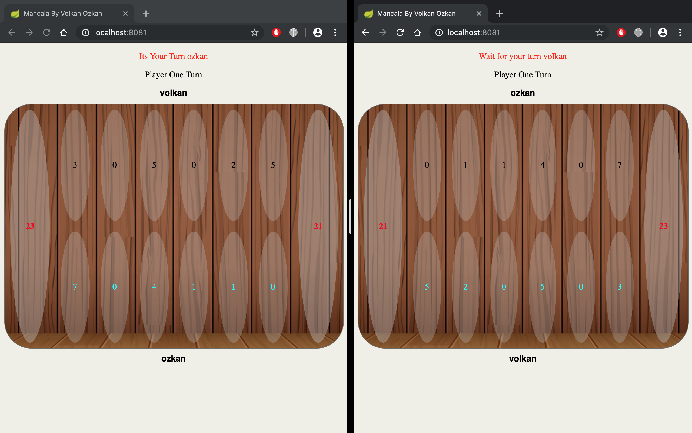

# Mancala Game (VolkanOzkan)
This is a java web application for playing Mancala game. 
For the Rules of the game visit following Wikipedia link: [https://en.wikipedia.org/wiki/Kalah](https://en.wikipedia.org/wiki/Kalah)

## Tech Stack
* Java
* Spring Boot
* AngularJS
* MongoDB
* Docker
* Maven

## Prerequisites
* Java 8+
* Maven
* Docker

## How to start the application

### Start Docker Containers
```
docker-compose up -d
```

### Run the application
```
$ mvn spring-boot:run
```

### Run tests
```
$ mvn test
```

## How to play
After running the project, browse
[http://localhost:9000](http://localhost:9000), You will be the first player if there is not any avaible game, if there is you will be join to available game as a second player and game will start.

From another machine, browser or tab access to same address([http://localhost:9000](http://localhost:9000)). Again rule is the same, you will join to existing game or you will be the first player of newly created game depends on the game availability.

Each player can move only his stones, game will end depend on the rules and determine the winner.
It is possible to play multiple games at one time since application is thread-safe based on WebSocketSessions.

## Author
Volkan Özkan

Screenshots:



